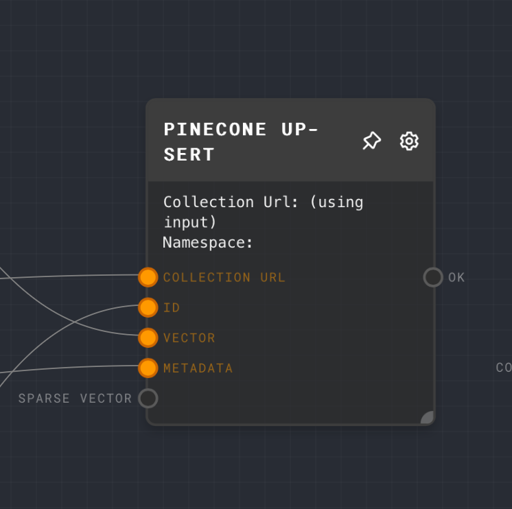

<h1 align="center"></h1>

## Description

This is an utilities plugin for rivet

### Iterator Node

The iterator Node will map through an array of object inputs `objectDataValues[][]`. The plugin will then call the subgraph you'd like to execute for item in the array.  Additionally

- it has a `chunkSize` option to limit the number of concurrent executions.
- it has a `cache` option to cache subgraph outputs of successful item runs.
- `graph` to run for each item in the array

#### Using the Iterator Node

Once install you can use it as show in the examples below.  Make sure the inputs are DataValues.

Inputs must be an array of objects to iterate over.  Each object in the array should be a ObjectDataValue `{type: 'object', value: <graph inputs>}`; where `<graph inputs>` is of the format `{type: `object `, value: {<graph input id>: <input value>}}` The graph input id should match the graph's input ports.  The input value should be a DataValue.

Ouputs will be an array of ObjectDataValue `type: `object `, value: {<graph output id>: <output value>}`

### Pipeline Node

The PipelineNode will take and input and run it through a pipeline of graphs (stages).  Each stage output should be the next graph's input.  The pipeline node has a optional pre/post stage to run before and after the pipeline stages.  Additionally, you have option to loop through the pipeline stages multiple with the `loop number` option.

- it has a `cache` option to cache subgraph outputs of successful item runs.
- it has a `loop number` option to loop through the pipeline stages multiple. `default 1`

#### The stage graphs

- `pre` optional graph
  - The output of the `pre` graph will be the input to the first stage graph
- `stage x` graphs
  - The output of the `x` graph will be the input to the next stage `y` graph
  - For example `stage 1` output will be the input to `stage 2`
  - You can loop through the stages `x` multiple times with the `loop number` option.    The output of the last loop will be the final output of the pipeline node.
- `post` optional graph
  - The output of the `post` graph will be the final output of the pipeline node

#### An example

An example of executing a pipeline with 3 stages and a pre/post stage

- run `pre stage`
  - output of `pre-stage` => `stage 0`
- run stage 0
  - output of `stage 0` => `stage 1`
- run `stage 1`
  - ouput of `stage 1` => `stage 2`
- run `stage 2`
  - if no `loop`: output of stage 2 => post-stage
  - if `loop`: output of stage 2 => stage 0. Repeat `loop number` times
- output of `stage n` => `post-stage`

### Pinecone Search Node

The node will allow you to query pinecone for vectors.  Allows `filters with metadata and sparse vectors`.   It also allows you to get `scores` back from the api.   You have access to `alpha` which is the weight of the sparse vector `1` vs dense vector `0`

### Pinecone Upsert Node

This node will allow you to upsert into pinecone.  It allows you to upsert `sparse vectors` and `metadata` as well.

## Installation

See [Rivet Plugins](https://rivet.ironcladapp.com/docs/user-guide/plugins) for more details

## Breaking changes

v0.3.0 has renamed the Iterator Node (from Iterator Plugin Node).  You'll have to readd the node

## Source

This was forked from: This project is an example of a [Rivet](https://github.com/Ironclad/rivet) plugin. It is a minimal TypeScript Rivet plugin that adds a single node called Example Plugin Node.

> See [Rivet Example Plugin](https://github.com/Ironclad/rivet) on details on plugin architecture and building it

Use `pnpm` to build and install
